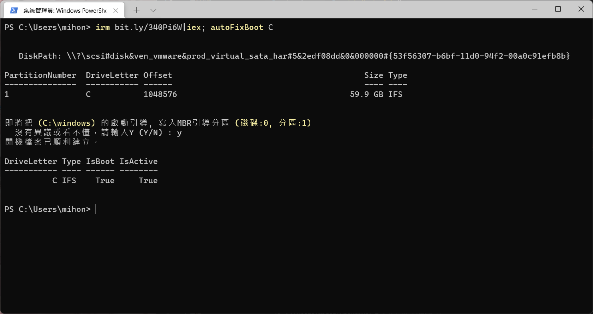
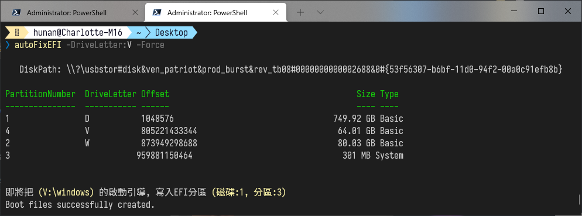
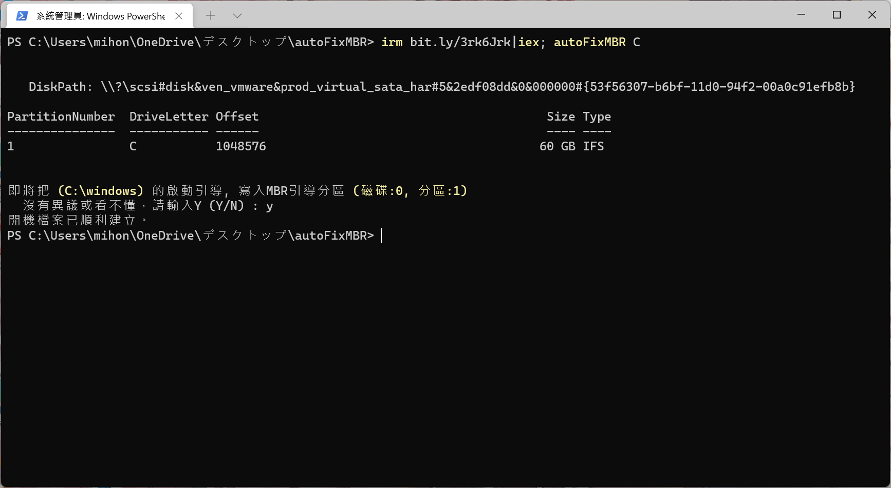

自動修復 Windows 啟動分區
===

打開終端機：按下 `Win+X` 然後再按下 `A`   

## EFI 和 MBR 自動選擇


```
irm bit.ly/340Pi6W|iex; autoFixBoot E
```


## EFI


輸入需要修復的 Windows 資料夾槽，程序會自動修復該磁碟中的EFI分區。  
下面指令預設的槽位是K槽，將硬碟接上電腦後請自行修改成對應的槽位。  

```
irm "https://raw.githubusercontent.com/hunandy14/autoFixEFI/master/autoFixEFI.ps1" | iex
autoFixEFI -DriveLetter:K
```

短網址指令

```
irm bit.ly/3EQwFzs|iex; autoFixEFI K
```


</br></br></br>

## MBR


```
irm "https://raw.githubusercontent.com/hunandy14/autoFixEFI/master/autoFixMBR.ps1"|iex
autoFixMBR -DriveLetter:K
```

```
irm bit.ly/3rk6Jrk|iex; autoFixMBR K
```

## 注意事項
預設會把啟動分區掛載到 B 曹位，如果該曹位已經被占用了，還沒寫防呆會直接報錯失敗。